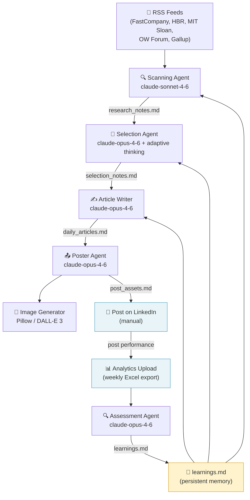

# LinkedIn Leadership Agent

A fully automated multi-agent pipeline that writes, formats, and critiques a daily LinkedIn thought-leadership post — and gets better over time through a built-in feedback loop.

**Human effort required**: ~5 minutes/day (review + post) · ~5 minutes/week (upload analytics)

---

## How it works



The pipeline runs automatically every weekday at 06:47. The assessment agent runs every Friday at 21:05, after you've uploaded the weekly analytics export.

---

## Agents at a glance

| Agent | Model | Purpose | Reads | Writes |
|---|---|---|---|---|
| **Scanning** | Sonnet 4.6 | Fetch sources, distil 3–5 topic candidates | RSS feeds, `learnings.md`, `daily_articles.md` | `research_notes.md` |
| **Selection** | Opus 4.6 + thinking | Pick the single best topic | `research_notes.md`, `daily_articles.md`, `learnings.md` | `selection_notes.md` |
| **Article Writer** | Opus 4.6 | Ghostwrite the LinkedIn post | `selection_notes.md`, `learnings.md`, `voice.md` | `daily_articles.md` |
| **Poster** | Opus 4.6 | Choose format, generate image card | `daily_articles.md`, `voice.md` | `post_assets.md`, `data/assets/*.png` |
| **Assessment** | Opus 4.6 | Critique the post, extract lessons | `daily_articles.md`, `selection_notes.md`, `post_assets.md`, analytics | `learnings.md` |

---

## Setup

### 1. Clone and install

```bash
git clone <your-repo>
cd linkedin-leadership-agent
pip3 install -r requirements.txt
```

### 2. Configure API keys

```bash
cp .env.example .env
```

Edit `.env`:

```env
ANTHROPIC_API_KEY=sk-ant-...       # required
OPENAI_API_KEY=sk-...              # optional — DALL-E 3 (--creative mode only)
GOOGLE_API_KEY=...                 # optional — Imagen 4 fallback (--creative mode only)
```

### 3. Add your voice

Edit `data/voice.md` — this is the single most important customisation. Describe:
- Who you are and what you write about
- Your sentence rhythm and tone
- What you want readers to feel
- Words/phrases to avoid

### 4. Add fonts

Download and place in `data/fonts/`:
- `PlayfairDisplay-Black.ttf` — headline font ([Google Fonts](https://fonts.google.com/specimen/Playfair+Display))
- `NotoSans-Bold.ttf` — subline font ([Google Fonts](https://fonts.google.com/specimen/Noto+Sans))
- `NotoSans-Regular.ttf` — caption font

### 5. Set up the scheduler (macOS)

```bash
launchctl load ~/Library/LaunchAgents/com.bene.linkedin-daily.plist
launchctl load ~/Library/LaunchAgents/com.bene.linkedin-assess.plist
```

The plist files are in `~/Library/LaunchAgents/`. Adjust times by editing and reloading.

---

## Daily workflow

| Time | What happens | Your action |
|---|---|---|
| **06:47** | Pipeline runs automatically | — |
| **~07:15** | macOS notification: "LinkedIn Post Ready" | Open `data/post_assets.md` |
| **Morning** | Review post + image | Copy text → post on LinkedIn, attach image |
| **Friday 19:00** | (Calendar reminder) | Download LinkedIn Analytics → drop `.xlsx` in `data/analytics/` |
| **Friday 21:05** | Assessment runs automatically | — |

---

## Running manually

```bash
# Full pipeline
python3 orchestrator.py

# Restart from a specific step
python3 orchestrator.py --from write

# Single agent only
python3 orchestrator.py --only post
python3 orchestrator.py --only assess

# Creative image mode (DALL-E 3 instead of typography card)
python3 orchestrator.py --only post --creative
```

Available agent names: `scan` · `select` · `write` · `post` · `assess`

---

## Output files

```
data/
├── research_notes.md      # Today's topic candidates (overwritten daily)
├── selection_notes.md     # Chosen topic + writing brief (overwritten daily)
├── daily_articles.md      # Cumulative post history
├── post_assets.md         # Final post text + format + image info
├── learnings.md           # Accumulated feedback (grows over time — the memory)
├── assets/                # Generated image cards (.png)
├── analytics/             # Drop weekly LinkedIn .xlsx exports here
├── fonts/                 # Typography fonts
└── pipeline.log           # Scheduler output log
```

---

## Customising for your content

To adapt this pipeline for your own LinkedIn presence, you only need to change four things:

1. **`data/voice.md`** — your writing style and persona
2. **`config.py` → `RSS_FEEDS`** — your source domains
3. **`config.py` → `EXTRA_SOURCES`** — any non-RSS sources
4. **`agents/scanning.py` → `SYSTEM_PROMPT`** — your topic pillars (currently: Individual Leadership / Team Collaboration / Coaching & Facilitation)

See [ADAPTING.md](ADAPTING.md) for a full guide.

---

## Project structure

```
linkedin-leadership-agent/
├── orchestrator.py          # Pipeline runner + CLI
├── config.py                # Shared config, file paths, API keys
├── agents/
│   ├── scanning.py          # Agent 1: topic discovery
│   ├── selection.py         # Agent 2: editorial selection
│   ├── article_writer.py    # Agent 3: ghostwriting
│   ├── poster.py            # Agent 4: format + image
│   ├── assessment.py        # Agent 5: critique + learning
│   ├── image_generator.py   # Pillow typography card renderer
│   └── analytics_reader.py  # LinkedIn Excel export parser
├── data/                    # Runtime data (git-ignored except templates)
└── ~/Library/LaunchAgents/  # macOS scheduler config
    ├── com.bene.linkedin-daily.plist
    └── com.bene.linkedin-assess.plist
```
